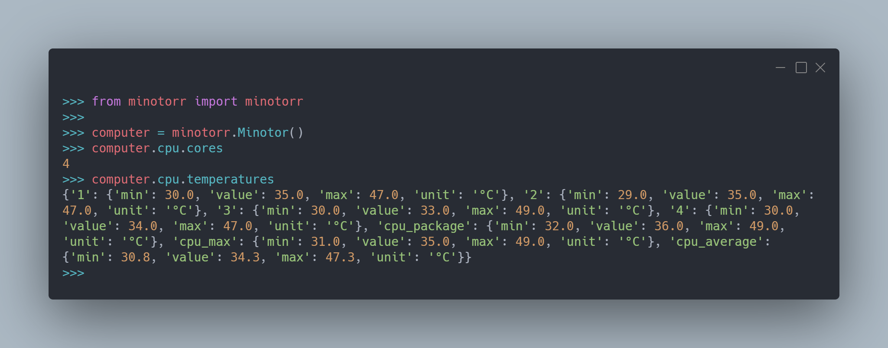

# Minotorr
> Unofficial Libre Hardware Monitor python client

Minotorr is a library that allows you to retrieve hardware informations from a Windows system based on the Libre Hardware Monitor tool.



## Installation

### Prerequisites

You need to download [Libre Hardware Monitor](https://ci.appveyor.com/project/LibreHardwareMonitor/librehardwaremonitor/build/artifacts).

Run it and start the web server. The program is now gathering information on the hardware.

### Library

Next install the library with PIP

```sh
pip install minotorr
```

## Usage example

```python
from minotorr import minotorr

comp = minotorr.Minotorr(port=2085) #default port 2085

print(comp.cpu.cores)
print(comp.cpu.temperatures)
```

## Release History

* 0.6.0
    * CHANGE: Update project name 
    * CHANGE: Update docs (module code remains unchanged)
* 0.1.0
    * The first proper release
* 0.0.1
    * Work in progress

## Meta

Gauthier Chaty – [@gokender](https://twitter.com/dbader_org) – gauthier.chaty+github@outlook.com

Distributed under the MIT license. See ``LICENSE`` for more information.

[https://github.com/Gokender](https://github.com/Gokender/)

